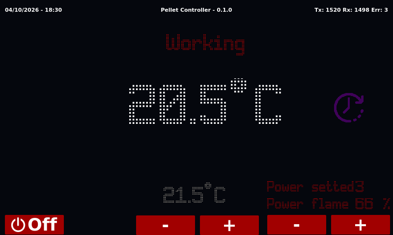
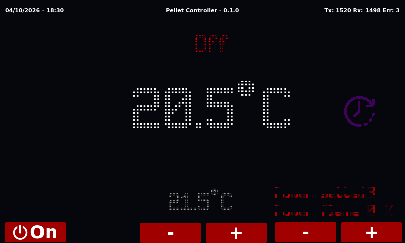
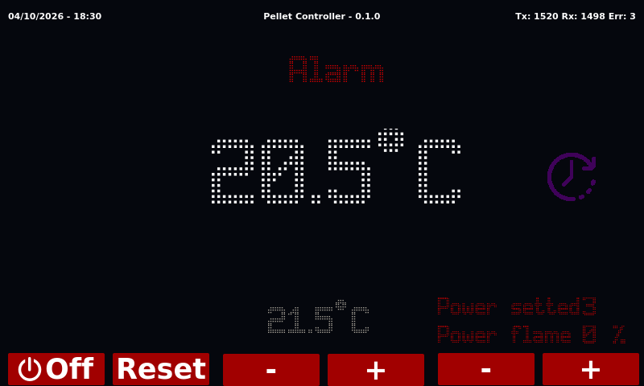
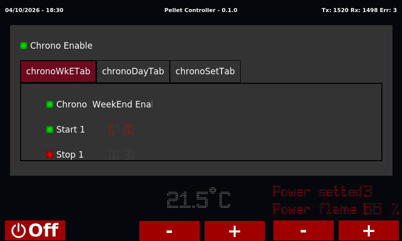
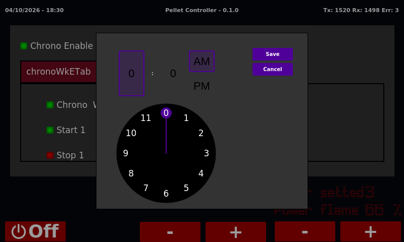

# Pellet Controller

Touch panel for a pellet stove, written in Qt 5 Widgets / C++17. It talks to
the stove board over a serial line: it shows the room temperature, the
stove state and the power, switches the stove on and off, changes the
setpoint and the power, and edits the stove chrono thermostat.

It runs on an 800x480 ARM display (32 or 64 bit) and on the desktop for
development.



## Features

- Room temperature, setpoint, stove state, set power and flame power
- Stove date and time, serial statistics (Tx / Rx / errors)
- On / Off with a confirmation, Reset after an alarm
- Setpoint -/+ in 0.5 °C steps, power -/+ from 1 to 5
- Chrono page: chrono on/off, weekend program on/off, weekend start time
  through a time picker; back to the main page after 10 s without touches

## Screenshots

| | |
|---|---|
|  |  |
| Stove off: the button turns it on | Alarm: Reset brings the stove to Off |
|  |  |
| Chrono page, weekend program | Time picker for a chrono slot |

The screenshots are rendered by `tools/guishot` with sample data, see
[Screenshots tool](#screenshots-tool).

## Repository layout

| Path | Content |
|---|---|
| `*.cpp`, `*.h`, `*.ui` | The application sources |
| `qss/`, `fonts/`, `icons/` | Style sheet, dot-matrix font, icons (`resources.qrc`) |
| `app/app.pro` | Application project, sources taken from the root |
| `CustomWidgets/` | Custom widgets, static library; `designer/`: optional Qt Designer plugin |
| `ThirdParty/` | External modules as git submodules: Qt Serial Port 5.13.2, built static |
| `tools/guishot/` | Screenshot tool for this README |
| `docs/` | [Known issues](docs/ISSUES.md), screenshots |
| `PelletController.pro` | Top level `subdirs` project: ThirdParty, CustomWidgets, app |
| `.qmake.conf` | `PC_SRC` and `PC_BUILD`, the source and build roots for every project |
| `version.pri` | Version from the latest git tag |

Application sources:

| File | Role |
|---|---|
| `main.cpp` | Startup, window frameless and maximized on the device, optional watchdog |
| `mainwindow.*` | Main page and chrono page (`QStackedWidget`), buttons and signal slots |
| `serialproto.*` | `SerialProto` singleton: serial port, polling, read and write of the stove parameters |
| `timeeditdialog.*` | Time picker dialog for the chrono slots |
| `common.h` | Name and version (`SW_NAME_VER`) |

Custom widgets: `wClickableLabel`, `wClickableLCDNumber` (an LCD that shows
a time in tens of minutes), `wClockWidget`, `wTimePicker`.

## Serial protocol

`SerialProto` uses `/dev/ttyUSB0` at 1200 baud, 8 data bits, no parity,
2 stop bits, no flow control. The line echoes what is sent, so every reply
starts with the request bytes.

The stove exposes two banks of byte parameters:

| Bank | Code | Content |
|---|---|---|
| RAM | `0x00` | Live values: room temperature, state, flame power, smoke, clock |
| EEPROM | `0x20` | Settings: setpoint, power, chrono |

Messages:

| Message | Sent | Received (after the echo) |
|---|---|---|
| Read | `bank`, `address` | `checksum`, `value` with `checksum = bank + address + value` |
| Write | `0x80 + bank`, `address`, `value`, `0x80 + bank + address + value` | `0x80 + bank + address + value`, `value` |

All sums are modulo 256.

Main parameters (`requestsMap` in `serialproto.h`):

| Parameter | Bank / address | Encoding |
|---|---|---|
| Room temperature | RAM `0x01` | value / 2 °C |
| Stove state | RAM `0x21` | 0 Off, 1 Starting, 2 Pellet Loading, 3 Ignition, 4 Working, 5 Brazier Cleaning, 6 Final Cleaning, 7 Standby, 8 Pellet Missing, 9 Ignition Failure, 10 Alarm |
| Flame power | RAM `0x34` | 0-16, shown as 10-100 % |
| Smoke fan speed | RAM `0x37` | value × 10 + 250 |
| Smoke temperature | RAM `0x5A` | °C |
| Date and time | RAM `0x65`-`0x6B` | seconds, day of week, hours, minutes, day, month, year - 2000 |
| Setpoint | EEPROM `0x7D` | value / 2 °C |
| Power | EEPROM `0x7F` | 1-5 |
| Chrono on/off | EEPROM `0x4C` | 0 / 1 |
| Chrono weekend, daily, weekly | EEPROM `0x42`-`0x74` | times in tens of minutes from 00:00 (0-143), 144 = slot off; day flags 0 / 1 |

On / Off writes the state: Starting to switch on, Final Cleaning to switch
off, Off for the Reset after an alarm.

Polling: one parameter every 200 ms, the stove state every other request,
a 2 s pause after each round. On the chrono page only the chrono
parameters are read. The I/O is non-blocking: a reply is complete when the
line stays idle for 100 ms, writes are queued and sent one at a time.

## Build

Requirements: Qt 5.13.2 (desktop) or the ARM SDK of the panel, and the
submodules:

```sh
git submodule update --init
```

Open `PelletController.pro` in Qt Creator, or build out of the source tree:

```sh
mkdir -p build/desktop && cd build/desktop
<Qt 5.13.2>/bin/qmake ../../PelletController.pro
make -j8
./bin_x86_64/PelletController
```

The build runs in order:
1. `ThirdParty`: Qt Serial Port from `ThirdParty/qtserialport`, built static
   with the qmake in use, only when the library is missing (after changing
   the submodule, delete `<build>/ThirdParty`)
2. `CustomWidgets`: `libcustomwidgets.a`
3. `app`: the application, linked with both, in `<build>/bin_<arch>/`

No shared library to deploy besides Qt itself: the panel does not have
`libQt5SerialPort`.

The target comes from `QT_ARCH`: `x86_64` builds the desktop version
(800x480 window), `arm` and `arm64` build the frameless full screen version
(`DEVICE` define in `app/app.pro`).

The application opens `/dev/ttyUSB0` at startup: without the stove the
values stay at `xx`.

Optional qmake arguments:

| Argument | Builds |
|---|---|
| `CONFIG+=tools` | `tools/guishot`, desktop only |
| `CONFIG+=designer` | `CustomWidgets/designer`: Qt Designer plugin with the custom widgets, `make install` copies it into the Qt in use |

## Version

The version comes from the latest git tag reachable from the built commit
(`version.pri`): `v0.1.0` gives `0.1.0`, a later commit `0.1.0-<hash>`,
no tag `0.0.0`. It is read when qmake runs: rerun qmake after a commit or a
tag. A release is just an annotated tag:

```sh
git tag -a vX.Y.Z -m vX.Y.Z
```

## Screenshots tool

`tools/guishot` builds the application GUI with sample data in place of the
stove and saves the screenshots of this README:

```sh
qmake PelletController.pro CONFIG+=tools && make
QT_QPA_PLATFORM=offscreen ./tools/guishot/guishot <repository>/docs/images
```

Run it on a machine without `/dev/ttyUSB0`: the GUI still opens the serial
port at startup.

## Known issues

The code review found several bugs, some of which can change the stove
settings without the user asking. See [docs/ISSUES.md](docs/ISSUES.md).
